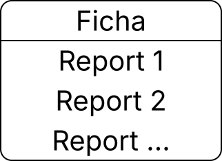

<h6 align="right">28/04/2026</h6>

# Domínio

Chamamos de domínio o conhecimento ou área específica em que um
sistema opera, definida por um conjunto de características que
descrevem uma família de problemas para os quais a aplicação visa
oferecer solução.

Para o projeto em questão, temos os seguintes domínios:

- `usuário`:
  entidade com capacidade para interagir com o sistema, sendo autor
  de eventos e recebedor de dados processados
- `usuário moderador`:
  similar ao anteriormente citado, mas com maiores privilégios
- `report`:
  registro gerado ao reportar um ponto de descarte irregular
  (relaciona-se com `local`)
- [`status do report`](#status-do-report)
- [`ficha`](#ficha)
- [`status da ficha`](#status-da-ficha)
- `local`:
  registro com informações de localidade

## Ficha

O termo 'ficha' refere-se ao registro com fim de relacionar um ou mais
`report`s a um `local`. Pense que, caso seja emitido um report, é
necessário não apenas associar o report a um lugar mas também
associar a um período (se houver +1 report antes de o local receber
os cuidados).

Sendo assim, a ficha funciona como um 'container' que armazena
`report`s relacionados:

_representação visual de uma ficha_

## Status do report

Uma vez que os reports possam ter os seus estados modificados,
necessita-se armazenar o estados atual + os estados possíveis. Isso
é chamado de `status do report` e é classificado como:

- `em aberto`:
  o report já foi aberto e aguarda para ser atendido.
- `suspenso`:
  quando o report é suspenso (temporariamente inválido) a partir de
  certa justificativa
- `cancelado`:
  quando o `usuário` autor ou o `usuário moderador` cancelam o report
  por não ser aplicável
- `atendido`:
  quando a ficha ao qual o `report` pertence já foi atendida
  (encerrada) 

## Status da ficha

Funciona de maneira similar ao [status do report](#status-do-report),
mas aplicável em específico para a(s) ficha(s), podendo ser
atualizado apenas por um `usuário moderador`.
