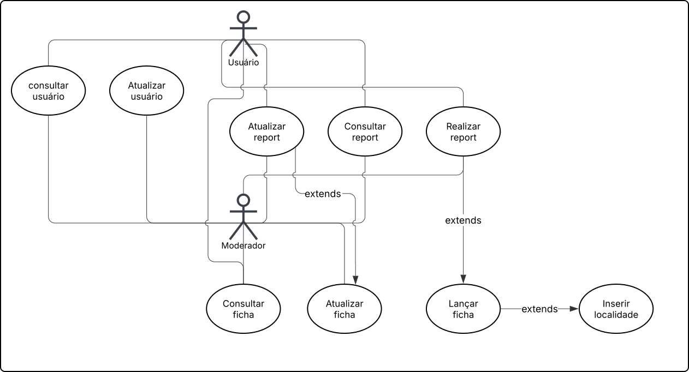

<h6 align="right">29/04/2026</h6>

# Casos de uso e regras de negócio

Quando desenvolvendo sistemas e aplicações, dois tópicos muito
abordados são **casos de uso** e **regras de negócio**.

<h6 align="right">30/04/2026</h6>

## Casos de uso

O projeto em questão é constituído pelos seguintes casos de uso:

1. consultar usuário
2. atualizar usuário
3. atualizar report
4. consultar report
5. realizar report
6. consultar ficha
7. atualizar ficha
8. lançar ficha
9. inserir localidade

## Regras de negócio

Para os casos de uso citados, temos as seguintes regras de negócio:

### 1. Consultar usuário

Nenhum campo do registro usuário é modificado durante consulta, sendo
assim, a consulta pode ser feita por ambos - o usuário e o moderador.

### 2. Atualizar usuário

Atualização do usuário refere-se ao:

- nome: troca de nome de usuário, feita pelo próprio usuário
- e-mail: troca de e-mail de usuário, feita pelo próprio usuário
- status: troca de status (`suspenso` e `válido`), feita pelo usuário
  moderador

O usuário consegue realizar as atualizações cadastrais desde que haja
ao menos **1 dia** desde a última atualização - ou seja a primeira
atualização - feita pelo mesmo. Note que para realizar esta
atualização é necessário que o novo nome e/ou e-mail não estejam
sendo utilizados por outro usuário.

### 3. Atualizar report

Atualização de report refere-se ao:

- status: status para o report em questão, podendo ser feito apenas
  pelo autor do report e pelo usuário moderador

O autor do report consegue atualizar o status apenas para
`cancelado`. Caso seja queira retornar para o status `em aberto`,
será necessário emitir um novo report.

O moderador consegue atualizar o status apenas de `em aberto` para
`cancelado`, `em aberto` para `suspenso` e vice-versa.

### 4. Consultar report

Assim como os registros de usuário, nenhum campo é modificado durante
consulta, sendo assim, a consulta pode ser feita por ambos - o
usuário e o moderador.

### 5. Realizar report

O report referente a um ponto de descarte irregular pode ser feito
por ambos o usuário e o moderador.

O usuário consegue emitir o report apenas se houver intervalo igual
ou superior a `1 dia` desde seu último report (desconsidera-se caso
não haja report anterior).

Limitação não ocorre para moderador.

### 6. Consultar ficha

Sem limitações para este caso de uso.

### 7. Atualizar ficha

Atualizar ficha significa modificar o status atual da ficha para:

- `suspensa`
- `atendida`
- `cancelada`
- ou `em aberto`

Apenas moderadores conseguem realizar essas atualizações.

Note que atualizar a ficha também significa atualizar os reports
relacionados com ela de maneira indireta.

### 8. Lançar ficha

Abertura da ficha é feita automaticamente quando é lançado um report
e:

- ainda não consta ficha para o local selecionado ou
- ficha mais recente consta como `cancelada`/`atendida`

### 9. Inserir localidade

Esse caso de uso refere-se à capacidade de adicionar um novo registro
de local ao sistema (caso não exista).
