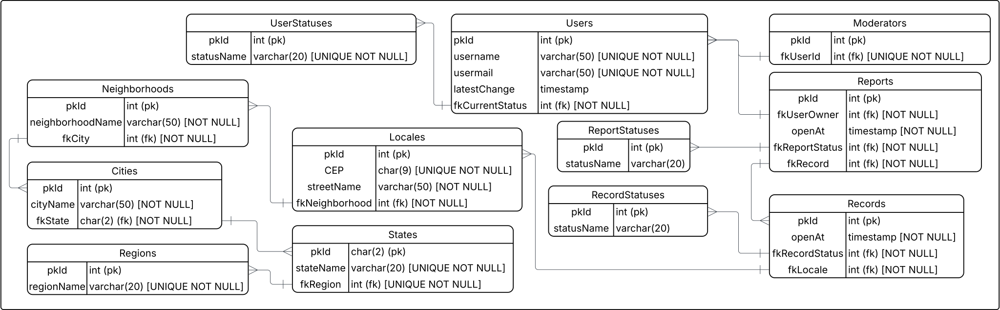

<h6 align="right">15/04/2026</h6>

# Entidades

_Entidades_ referem-se a:

> objeto ou conceito que possui uma identidade única e é reconhecido
> dentro de um sistema, representando elementos que podem ser
> manipulados, armazenados e recuperados.

Resumindo, é uma palavra comumente usada para expressar tabelas em
banco de dados.

## Qual a necessidade?

Estabelecer previamente as entidades contribui com o desenvolvimento
do fluxo do projeto.

Por termos ciência das entidades, sabemos exatamente:

- Quais dados são necessários para adicionar um novo item em uma
  tabela
- Quais dados são retornados ao consultar um item em uma tabela
- Quais dados devem ser avaliados (antes de/durante) sua inserção na
  tabela

<h6 align="right">02/05/2026</h6>

## Estrutura das entidades

A seguir temos a estrura das entidades usadas no projeto **(até
então)**:

- `Users` armazena os usuários, sendo eles vinculados a um nome,
  e-mail (ambos únicos e não nulos) e status de usuário _(registro
  presente em `UserStatuses`)_
- `Moderators` armazena os _super-usuários_ (moderadores) - detém as
  mesmas capacidades de um usuário comum mas com privilégios extras
- `Reports` armazena os reports emitidos pelos usuários. Eles são
  vinculados a um autor (usuário), `timestamp` de abertura, status
  de report (armazenado na tabela `ReportStatuses`) e à ficha
  (`record`)
- `Records` armazena as fichas de ponto de descarte, estando
  vinculadas a um `timestamp` de abertura, um status de ficha
  (armazenado em `RecordStatuses`) e um local
- `Locales` armazena os locais que são constituídos por um `CEP`,
  nome da rua e o bairro ao qual pertencem
- `Neighborhoods` armazena os bairros, constituídos pelo nome e a
  cidade ao qual pertencem
- `Cities` armazena as cidades, constituídas pelo nome e estado ao
  qual pertencem
- `States` armazena os estados, constituídos pelo nome e região ao
  qual pertencem
- `Regions` armazena as regiões, constituídas apenas pelo nome
