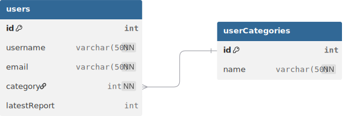
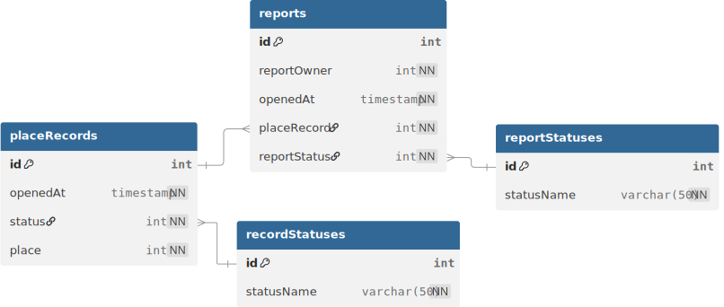

<h6 align="right">15/04/2026</h6>

# Entidades

_Entidades_ referem-se a:

> objeto ou conceito que possui uma identidade única e é reconhecido
> dentro de um sistema, representando elementos que podem ser
> manipulados, armazenados e recuperados.

Resumindo, é uma palavra comumente usada para expressar tabelas em
banco de dados.

## Qual a necessidade?

Estabelecer previamente as entidades contribui com o desenvolvimento
do fluxo do projeto.

Por termos ciência das entidades, sabemos exatamente:

- Quais dados são necessários para adicionar um novo item em uma
  tabela
- Quais dados são retornados ao consultar um item em uma tabela
- Quais dados devem ser avaliados (antes de/durante) sua inserção na
  tabela

<h6 align="right">18/04/2026</h6>

## Estrutura das entidades

A seguir temos a estrura das entidades usadas no projeto **(até
então)**:

> [!NOTE]
>
> Para evitar ambiguidade de linguagem, os termos serão tratados em
> inglês, já que essa é uma restrição não só da maioria dos bancos de
> dados mas também de boa parte das tecnologias utilizadas no
> projeto.

### Usuários e categoria de usuários

  

A(s) entidade(s):

- `users`: usuários registrados no sistema. São constituídos por
  - `id`: **int como chave primária**, identifica este usuário como
    único
  - `username`: **string não nula e única**, usada como nome de
    usuário
  - `email`: **string não nula e única**, usada como email de usuário
  - `category`: **int não nulo como chave estrangeira (refere-se à
    `userCategories.id`)**, identifica a categoria do usuário
  - `latestReport`: **int estrangeiro (refere-se à `reports.id`) e
    único**, identifica o último report feito por este usuário
- `userCategories`: categorias de usuário registradas no sistema. São
  contituídas por
  - `id`: **int como chave primária**, identifica esta categoria como
    única
  - `name`: **string não nula e único**, usada como nome da categoria

### Reports, fichas e status

  

A(s) entidade(s):

- `reports`: reports efetuados no sistema. São constituídos por
  - `id`: **int como chave primária**, identifica este report como
    único
  - `reportOwner`: **int estrangeiro (refere-se à `users.id`) não
    nulo**, refere-se ao usuário que realizou este report
  - `openedAt`: **timestamp não nulo**, refere-se quando esse report
    foi feito
  - `placeRecord`: **int estrangeiro (refere-se à `placeRecord.id`)
    não nulo**, refere-se à ficha do local ao qual o report foi feito
  - `reportStatus`: **int estrangeiro (refere-se à
    `reportStatuses.id`) não nulo**, refere-se ao status deste report
- `placeRecords`: fichas que são abertas referentes ao locais
  reportados. São constituídas por
  - `id`: **int como chave primária**, identifica esta ficha como
    única
  - `openedAt`: **timestamp não nulo**, refere-se quando a ficha foi
    aberta
  - `status`: **int estrangeiro (refere-se à `recordStatuses.id`) não
    nulo**, refere-se ao status da ficha
  - `place`: **int estrangeiro (refere-se à `places.id`) não nulo**,
    refere-se ao local que a ficha representa
- `recordStatuses`: possíveis status para as fichas. São constituídos
  por
  - `id`: **int como chave primária**, identifica este status como
    único
  - `statusName`: **string não nula e única**, refere-se ao nome do
    status
- `reportStatuses`: possíveis status para os reports. São
  constituídos por
  - `id`: **int como chave primária**, identifica este status como
    único
  - `statusName`: **string não nula e única**, refere-se ao nome do
    status
